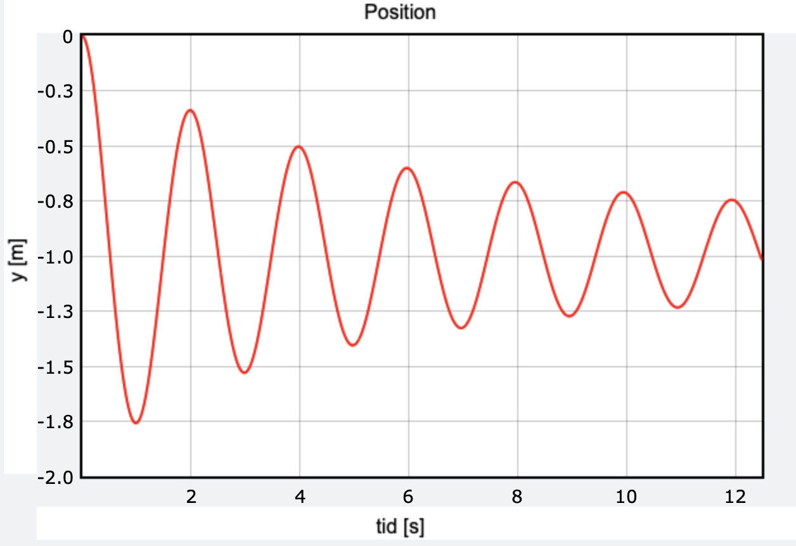

## Indholdsfortegnelse
* [Horisontal bevægelse](https://mpsteenstrup.github.io/hookes-lov/horisontal-bevaegelse.html)
* [Vertikal position](https://mpsteenstrup.github.io/hookes-lov/vertikal-bevaegelse-position.html)
* [Vertikal energi](https://mpsteenstrup.github.io/hookes-lov/vertikal-bevaegelse-energi.html)
* [System med dæmpning](https://mpsteenstrup.github.io/hookes-lov/daempning.html)
* [Bevægelsesligningerne](https://mpsteenstrup.github.io/hookes-lov/bevaegelsesligningerne.html)

# system med dæmpning
Vi vil simulere et system som svingen med en dæmpning som er proportional med farten i anden, hvilket svarer til en luftmodstand. Simuleringen er den sammen som ved lodret bevægelse men nu er kraften ændret så den er
$$
F = F_{fjeder}+F_{tyngde}+F_{dæmpning}
$$

Dæmpningen bliver tilføjet med ```-d*v*abs(v)``` hvor ```v*abs(v)``` sørger for at kraften altid er modsatrettet bevægelsen, altså dæmpning.


[https://glowscript.org/#/user/mps/folder/hookeslov/program/vertikal-daempning](https://glowscript.org/#/user/mps/folder/hookeslov/program/vertikal-daempning)

###Øvelse

* Kør programmet. 
* Lav ```d``` større og beskriv bevægelsen.
* Lav ```d``` negativ, hvad sker der så?


## Periodisk påvirket system
En udvidelse af simuleringen er at simulere et drevet pendul, hvor vi tilføjer en periodisk kraft. 