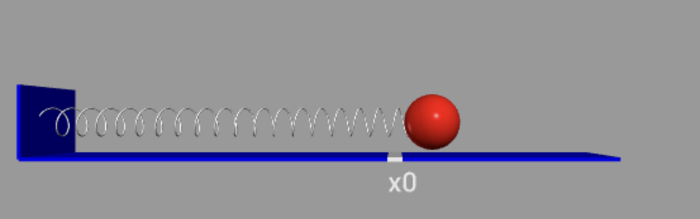

## Indholdsfortegnelse
* [Horisontal bevægelse](https://mpsteenstrup.github.io/hookes-lov/horisontal-bevaegelse.html)
* [Vertikal position](https://mpsteenstrup.github.io/hookes-lov/vertikal-bevaegelse-position.html)
* [Vertikal energi](https://mpsteenstrup.github.io/hookes-lov/vertikal-bevaegelse-energi.html)
* [System med dæmpning](https://mpsteenstrup.github.io/hookes-lov/daempning.html)
* [Bevægelsesligningerne](https://mpsteenstrup.github.io/hookes-lov/bevaegelsesligningerne.html)

# Horisontal bevægelse
Mange legemer kan ved små deformation beskrives ved Hooks lov. Det klassiske eksempel er en fjeder, men de fleste elastiske materialer og eks. stål ved let bøjning kan beskrives ved hooks lov. Hooks lov siger, at kraften, F, er proportional med længden af deformationen fra ligevægt, x. For en fjeder er det længden som flederen bliver hevet væk fra ligevægt. 

$$
F = -k\cdot x, 
$$ 

k kaldes fjederkonstanten og har ehneden newton/meter.

Her er en simulation med en fjeder med fjederkonstant på, k=10N/m, og en masse af kuglen på, m=1kg. Simulationen er vandret for at undgå at tage tyngdekraften med i beregningerne. Vi antager også at der ingen gnidningsmodstand er.

[https://glowscript.org/#/user/mps/folder/hookeslov/program/horisontal](https://glowscript.org/#/user/mps/folder/hookeslov/program/horisontal)

* Beskriv bevægelsen i forhold til den røde (t,s) graf.
* Beskriv bevægelsen i frohold til den blå (t,v) graf.
* Prøv at ændre på fjederkonstanten, k.
* Prøv at ændre på massen, m, og beskriv hvad der er sker.
* Prøv at forklar det ved brug af Newtons 2. lov.

Den mekaniske energi kan ses ved at sætte s=2. Så plottes grafen for den kinetiske og potentielle energi.

* Hvornår er den potentielle energi størst?
* Hvornår er den kinetiske energi størst?
* Undersøg om den mekaniske energi er bevaret.

