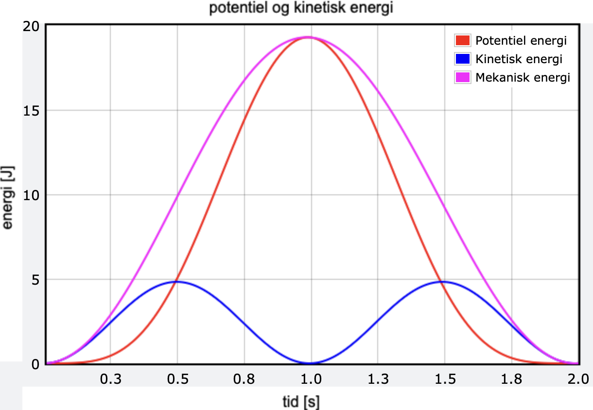

## Indholdsfortegnelse
* [Horisontal bevægelse](https://mpsteenstrup.github.io/hookes-lov/horisontal-bevaegelse.html)
* [Vertikal position](https://mpsteenstrup.github.io/hookes-lov/vertikal-bevaegelse-position.html)
* [Vertikal energi](https://mpsteenstrup.github.io/hookes-lov/vertikal-bevaegelse-energi.html)
* [System med dæmpning](https://mpsteenstrup.github.io/hookes-lov/daempning.html)
* [Bevægelsesligningerne](https://mpsteenstrup.github.io/hookes-lov/bevaegelsesligningerne.html)

# Vertikal bevægelse - energi
Vi skal undersøge energien i systemet hvor vi ved at

$$
E_{kin} = 1/2·m·v^2
$$
$$
E_{pot,hook} = 1/2·k·y^2
$$


[https://glowscript.org/#/user/mps/folder/hookeslov/program/vertikal-energi](https://glowscript.org/#/user/mps/folder/hookeslov/program/vertikal-energi)


* Plot den mekaniske energi ved at fjerne # i koden.
* Er der energibevarelse i systemet?
* Tilføj den potentielle energi fra bevægelsen i tyngdefeltet, ``` m*g*y ```.
* beskriv den potentielle energi, hvornår er den størst og mindst mindst.
* Den mekaniske energi skal være bevaret, altså konstant. Er den det?

Hvis man laver forsøget rigtigt finder man at den mekaniske energi stadigt ikke er bevaret. Den mekaniske energi svinger op og ned.

* Kan den mekaniske energi blive større hvis det er dæmpningen i systemet vi har glemt?
* svaret er nej, men hvad kan det så være? ( hint i vores simulation er fjederen vægtløs, det er den ikke i virkeligheden).

